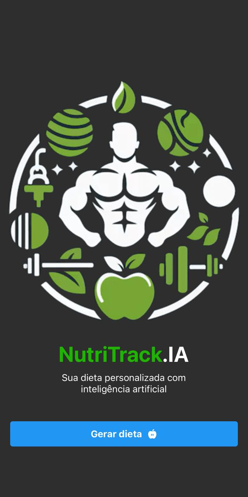
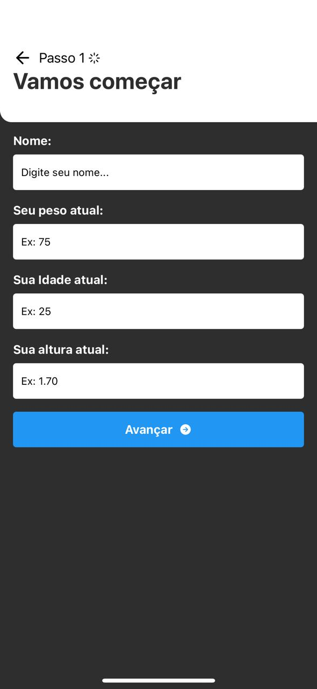
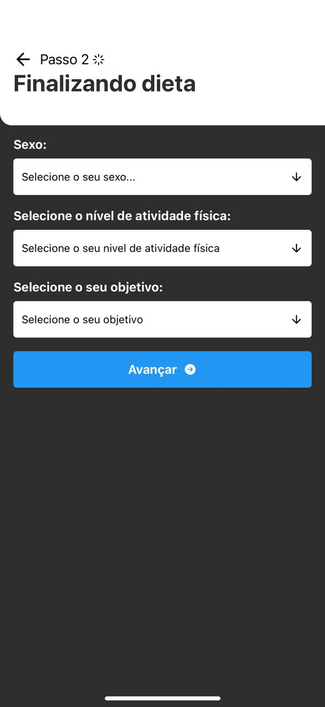
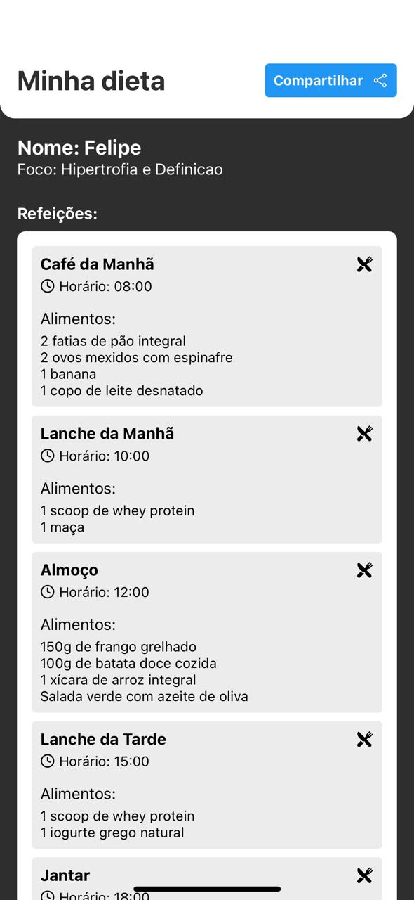
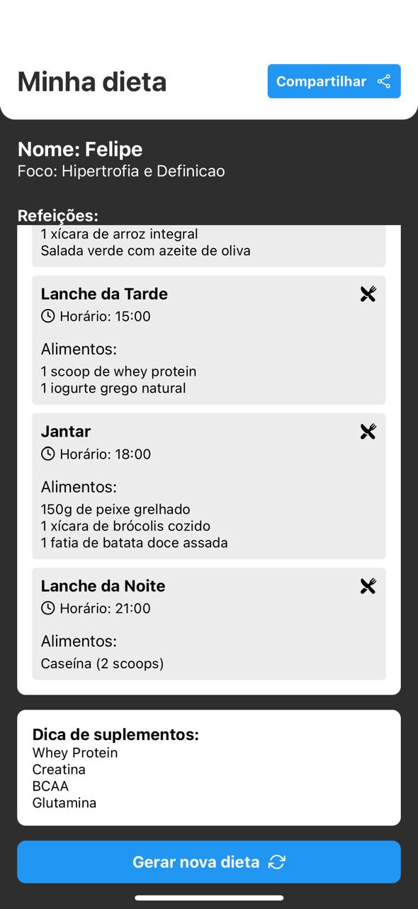

# NutriTrack - App de Dieta

NutriTrack é um aplicativo de dieta desenvolvido para ajudar os usuários a gerar suas refeições de forma prática e saudável com IA. Este projeto foi construído utilizando o Expo, React Native e outras tecnologias modernas.

## Screenshots

 
 



## Tecnologias Utilizadas

- **Linguagens**: 
  - JavaScript
  - TypeScript (opcional, dependendo do uso no projeto)
- **Framework**: 
  - React Native
- **Gerenciamento de Estado**: 
  - Zustand
- **Navegação**: 
  - Expo Router
- **Icones**: 
  - Ionicons
  - Feather
- **Estilização**: 
  - StyleSheet do React Native

## Pré-requisitos

Antes de começar, você precisará ter o seguinte instalado em sua máquina:

- [Node.js](https://nodejs.org/) (versão 12 ou superior)
- [Expo CLI](https://docs.expo.dev/get-started/installation/) (instale globalmente com `npm install -g expo-cli`)
- [Emulador Android](https://docs.expo.dev/workflow/android-studio-emulator/)
- [Emulador IOS](https://docs.expo.dev/workflow/ios-simulator/)
- [Expo GO](https://expo.dev/go) , um sandbox limitado para testar o desenvolvimento de aplicativos com o Expo

## Como Iniciar o App

Siga as etapas abaixo para iniciar o aplicativo em sua máquina:

1. **Clone o repositório**:

   ```bash
   git clone https://github.com/fbarnabe-dev/NutriTrack.IA.git

2. **Navegue até o diretório do projeto**:

   ```bash
   cd nutritrack

3. **Instale as dependências:**

   ```bash
   npm install

4. **Inicie o projeto**:

     ```bash
   expo start

5. **Abra o aplicativo no seu dispositivo**:

   • Escaneie o QR code que aparecerá no terminal ou no navegador usando o aplicativo Expo Go (disponível na Play Store e App Store).
   • Ou pressione A para abrir no emulador

6. **Funcionalidades**:

- Geração de dietas personalizadas
- Compartilhar
- Interface amigável e responsiva
- Em breve mais funcionalidades

## Créditos

Este projeto foi inspirado pelo trabalho de [devfraga](https://github.com/devfraga).
